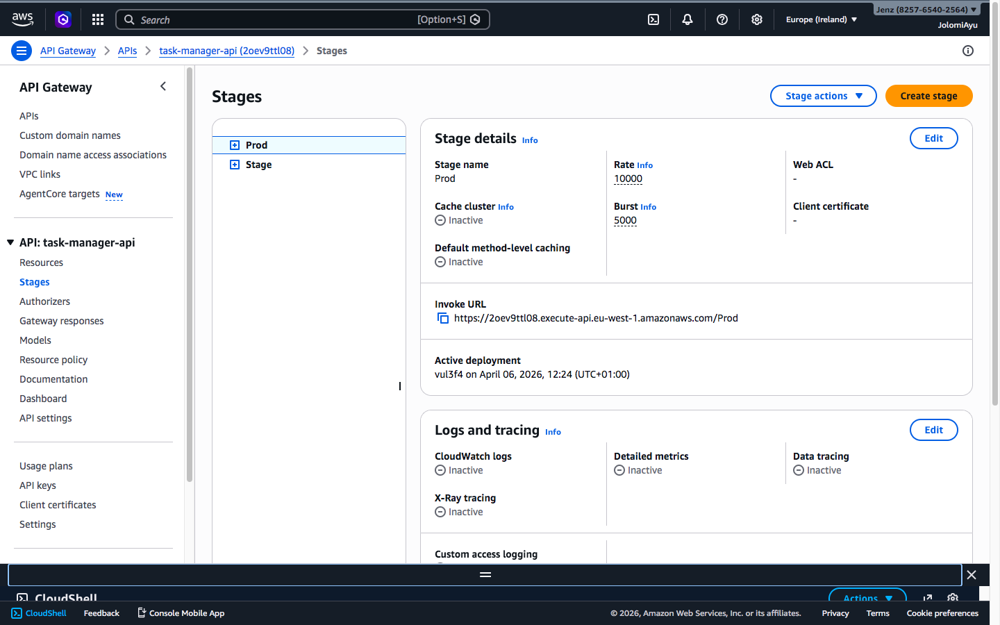
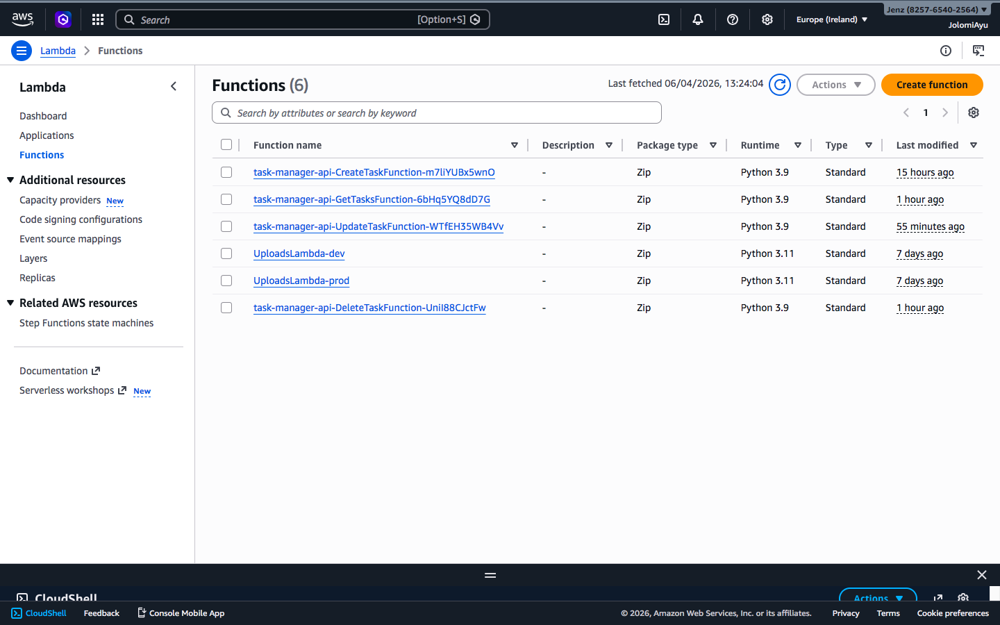
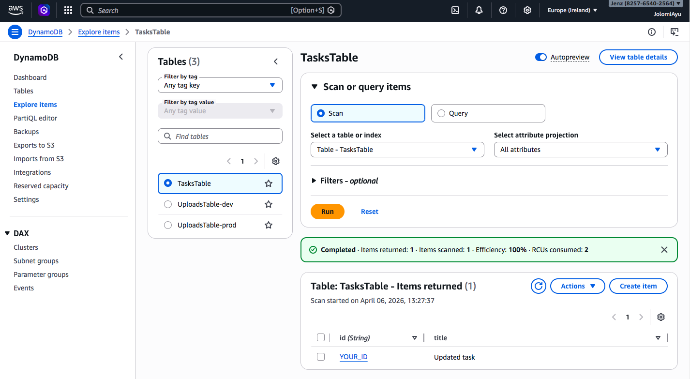
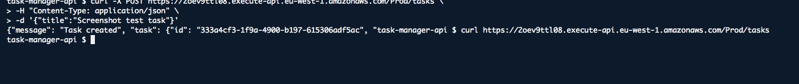

🚀 AWS Serverless Task Manager API

Deployed and tested on AWS with a live public API endpoint.

📌 Overview

This project demonstrates a fully serverless REST API built on AWS.

It allows users to:

- Create tasks
- Retrieve tasks
- Update tasks
- Delete tasks

The system is designed using an event-driven architecture and deployed using AWS SAM.

---

🏗️ Architecture

- AWS Lambda (compute)
- API Gateway (HTTP endpoints)
- DynamoDB (database)
- AWS SAM (deployment)

---

⚙️ Tech Stack

- Python
- AWS Lambda
- Amazon API Gateway
- Amazon DynamoDB
- AWS SAM (Serverless Application Model)

---

🌐 Live API

https://2oev9ttl08.execute-api.eu-west-1.amazonaws.com/Prod

---

📡 API Endpoints

Method| Endpoint| Description
POST| /tasks| Create a task
GET| /tasks| Get all tasks
PUT| /tasks/{id}| Update a task
DELETE| /tasks/{id}| Delete a task

---

🧪 Example Requests

Create Task

curl -X POST https://2oev9ttl08.execute-api.eu-west-1.amazonaws.com/Prod/tasks \
-H "Content-Type: application/json" \
-d '{"title":"My task"}'

Get Tasks

curl https://2oev9ttl08.execute-api.eu-west-1.amazonaws.com/Prod/tasks

Update Task

curl -X PUT https://2oev9ttl08.execute-api.eu-west-1.amazonaws.com/Prod/tasks/{id} \
-H "Content-Type: application/json" \
-d '{"title":"Updated task"}'

Delete Task

curl -X DELETE https://2oev9ttl08.execute-api.eu-west-1.amazonaws.com/Prod/tasks/{id}

---

## 📸 Screenshots

### 🔹 API Gateway


### 🔹 Lambda Functions


### 🔹 DynamoDB Table


### 🔹 API Test (CloudShell)


---

🚀 Deployment

sam build
sam deploy

---

🎯 What I Learned

- Building serverless applications on AWS
- API Gateway + Lambda integration
- DynamoDB operations
- Infrastructure as Code using SAM
- Debugging real deployment issues

---

💡 Future Improvements

- Add authentication (JWT / Cognito)
- Add pagination
- Add CI/CD pipeline (CodePipeline)
- Add frontend (React)

---

👤 Author

Built by Jolomi Ayu

 ## 🚨 Monitoring & Alerting (Project 9)

This project includes production-level monitoring and alerting:

- 📊 AWS CloudWatch Metrics for Lambda errors
- 🚨 CloudWatch Alarm triggered on failures
- 📩 SNS Email Notifications for real-time alerts

### How it works

1. When an error occurs in the Lambda function  
2. CloudWatch detects the error metric  
3. Alarm state changes to ALARM  
4. SNS sends an email notification  

### Test

```bash
curl -X POST "https://your-api-url/Prod/tasks?fail=true"

# 📤 Then commit

```bash
git add .
git commit -m "Add monitoring and alerting (Project 9)"
git push

## 🔐 Authentication & Security (Project 10)

This project now includes JWT-based authentication to secure API endpoints.

### Features

- 🔑 Login endpoint (/login)
- 🔐 JWT token generation
- 🚫 Protected endpoints (require valid token)
- 🛡️ Unauthorized requests are blocked

### How it works

1. User sends credentials to /login
2. Server returns a JWT token
3. Client includes token in request header:

Authorization: Bearer <token>

4. Lambda validates the token before processing the request

### Test Authentication

#### 1. Get Token

```bash
curl -X POST https://2oev9ttl08.execute-api.eu-west-1.amazonaws.com/Prod/login \
-H "Content-Type: application/json" \
-d '{"username":"admin","password":"password"}'

2. Access Protected Endpoint
Bash
curl -X POST https://2oev9ttl08.execute-api.eu-west-1.amazonaws.com/Prod/tasks \
-H "Content-Type: application/json" \
-H "Authorization: Bearer YOUR_TOKEN" \
-d '{"title":"secure task"}'
Security Note
This is a simplified JWT implementation for learning purposes.
In production, secrets should be stored securely (e.g., AWS Secrets Manager).
